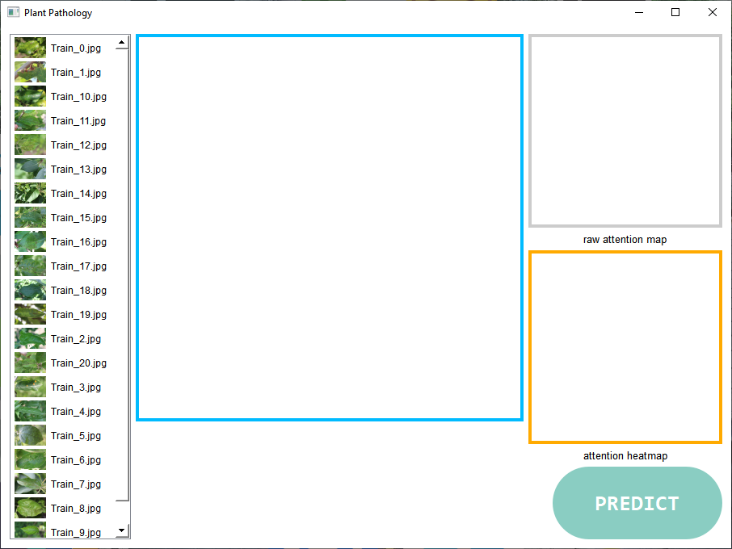
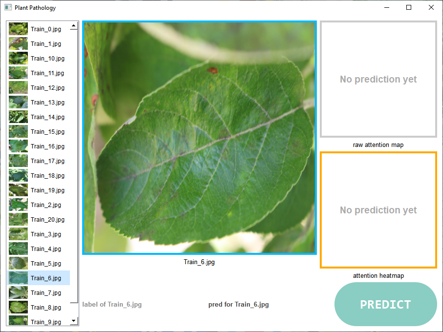
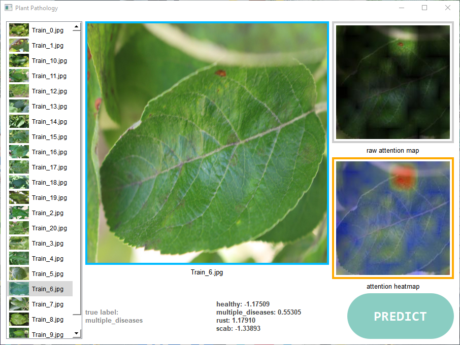
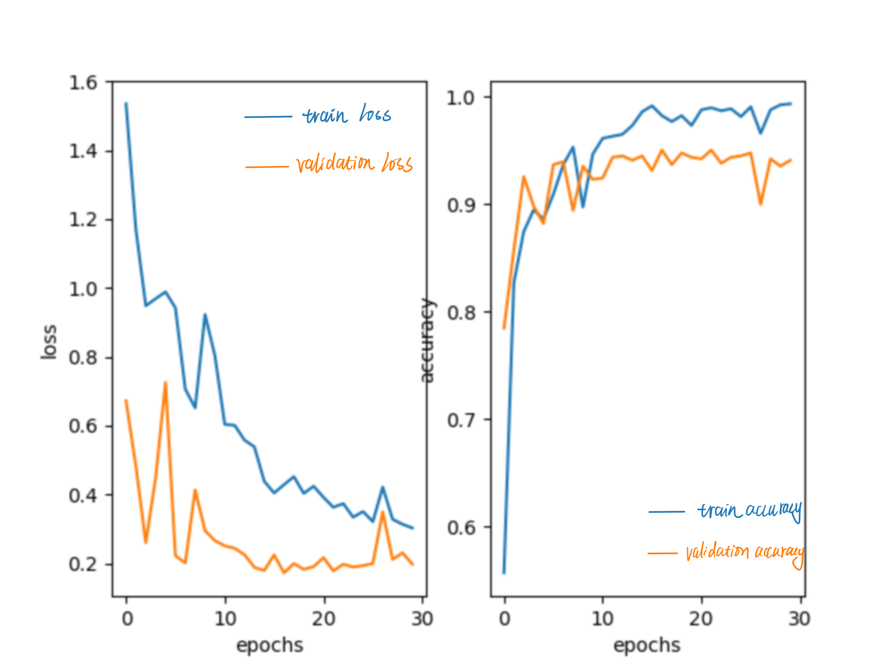

# Plant Pathology

## Run

1. `git clone` this repo.
2. Prepare image dataset and put the images into `data/sample_img/`
3. goto `code/`, then  
    `$ python3 main.py` for training.  
    `$ python3 GUI.py` to start GUI and start evaluation and visualization.  
    

    
    
    
    

    <!-- 
    
     -->

## Attention Maps Visualization  

Code in `code/eval.py` helps generate attention maps. (croped image, Heat attention map, Image x Attention map)  

<!--   

 -->

## Loss graph  

